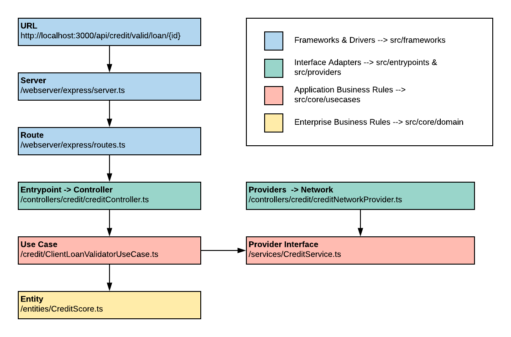

# ${companyname}-${appname}-api

This is a basic project for creating Express applications.

---

## Stack de Tecnologia

| Technology | Role | 
| --- | --- |
| **[Typescript](https://www.typescriptlang.org/)** | 	TypeScript is an open source object-oriented language. It is a typed superset of JavaScript that is compiled for simple JavaScript. |
| **[express](https://expressjs.com/)** | REST API structure, responsible for routing and analyzing HTTP requests and responses. | 
| **[tsoa](https://github.com/lukeautry/tsoa)** | Framework responsible for automatically registering ** Express ** routes and generating ** Swagger ** documentation for all REST controllers in the application using annotations in the controllers. | 
| **[InversifyJS](https://github.com/inversify/InversifyJS)** | InversifyJS is a lightweight inversion of control (IoC) container for TypeScript and JavaScript applications. An IoC container uses a class constructor to identify and inject its dependencies. InversifyJS has a friendly API and encourages the use of OOP and IoC best practices. |
| **[Jest](https://jestjs.io/)** | Library responsible for unit tests. |
| **[tsLint](https://palantir.github.io/tslint/)** | Typescript source code analysis tool that help find programming errors, bugs, stylistic errors and suspicious constructions. |
| **[Swagger](https://swagger.io/)** | Software framework that helps developers to design, create, document and consume RESTful services. |
| **[SonarQube](https://www.sonarqube.org/)** | Continuous code quality inspection software. Perform automatic reviews with static code analysis to detect bugs, problematic codes and vulnerabilities |
| **[Husky](https://github.com/typicode/husky#readme)** | Framework to crete git hooks. It is used to guarantee quality in `commits` and `push` |
| **[express-actuator](https://github.com/rcruzper/express-actuator#readme/)** | Middleware that automatically creates some endpoints to monitor the application |

---

## Configuring VSCode

É recomendado a instalação das seguintes extensões, para que facilite a aplicação correta dos padrões de código:

It is recommended to install the following extensions, to help with the application code standards:

- [TSLint](https://marketplace.visualstudio.com/items?itemName=ms-vscode.vscode-typescript-tslint-plugin)

---

Running locally

1. Install the project's dependencies by running the command below on the terminal:

   ```bash
   npm install
   ```

2. Launch the application:

   ```bash
   npm run start
   ```

3. The Express application will start and it will create a swagger page with the documentation at:

   ```
   http://localhost:3000/api-docs/

   ```
The command `start` is a shortcut that runs two other scripts:

1. `npm run build-routes` - Automatically generates Express routes and Swagger documentation for all controllers;
2. `npm run dev`- Starts the tsc compiler in watch mode, so you can check the changes without having to restart the application.

At development time, if you have already executed the first command and have not changed any controller, you can restart the application by running just `npm run dev`

---

## Running thru Docker

This is the fastest and easiest way to run the application locally. It only requires that you have a docker mechanism installed on your machine. The downside is that it will not provide you with a simple and standard way to debug the application using your IDE.

1. Create a docker image by running the following command:

   ```bash
   npm install
   docker build -t ${companyname}-${appname}-api:latest .
   ```

2. Run a new container with the created image:

   ```bash
   docker run -p 3000:3000 ${companyname}-${appname}-api:latest
   ```

---

## Running in debug mode 

In this project structure, there is a file called `.vscode/launch.json` that automatically configures the VSCode debugger. To start debugging, click on the "Debug" tab and then "Start and Debug" at the top of the window.

Before starting debugging it is necessary to run the script that generates express routes: `npm run build-routes`.

---

## Ensuring code quality, unit tests and test coverage

Before opening a merge request, make sure your code meets the quality standards defined for this project.

1. Run the unit tests and check the test coverage by running the following command:

   ```bash
   npm run test:ci
   ```

   This command will run all tests and display a coverage report.
   An HTML version of this report will be saved to `./coverage/lcov-report/index.html.`
   Make sure that all you code has code coverage.
   
2. Run the lint analysis by running the following command:

   ```bash
   npm run lint:fix
   ```

   This command will analyze and correct possible lint errors, such as indentation, lack of semicolons. Critical errors will be displayed at the end. 
   Correct all errors and run again if necessary.

---

## Running unit tests in debug mode

You can run unit tests in debug mode to fix more complex errors. There is a configuration available in the file `.vscode/launch.json.`

To run the tests in debug mode, open the "Debug" tab and click "Debug Tests" at the top of the window

Before starting debugging it is necessary to run the script that generates express route: `npm run build-routes`.

---

## Running Sonarqube and sending the results to a sonarqube service

Para executar a análise do sonarqube e enviá-la para o servidor, execute os seguintes passos

1. Make sure the `analyze.js` file is updated with the correct server path and project version.

2. Run the sonarqube analysis by running the following command:

   ```bash
   npm run sonar
   ```

  This command will execute all tests, colect the lcoc file and send to configured sonarqube server.

---

## Code traceability and monitoring

This project uses a middleware called `express-actuator` that provides 3 endpoints for code traceability and monitoring. Are they:

| Endpoint | Role | 
| --- | --- |
| **/management/info** | Returns information from the last commit |
| **/management/health** | Returns the application status |
| **/management/metrics** | Returns the metrics of the application |

For more information, consult the [github page](https://github.com/rcruzper/express-actuator).

---

## Automated versioning 

This project uses `npm-version` to increase the project version.
On your CI/CD pipeline, you can use the following commands to increase the project version, and create a git tag. 

To increse the major version use:
``` bash
npm run version:major

```


To increse the minor version use:
``` bash
npm run version:minor

```


To increse the patch version use:
``` bash
npm run version:patch

```

Before updating the version, a command to compile the project will be triggered with a couple of commands to check test cases and lint.

---

## Architecture and Standards
This project follows the principles and project structure defined by Robert C. Martin (Uncle Bob) in his book "Clean Architecture"

Robert C. Martin, better known as Uncle Bob, proposed an architecture style called Clean Architecture, where the different parts of the system have a low degree of dependence, that is, poor coupling, resulting in easy maintenance and testability.

This style was derived from other existing architectural ideas, among them the Onion Architecture and Hexagonal Architecture, which in essence, shared similar ideas. Clean Architecture's premises are:

* Framework Independence: The architecture should not depend on any specific Framework, that is, they should only be used as tools.
* Testability: Business rules can be tested independently, and should not depend on any other elements.
* Independence of User Interface: The user interface or Front-end must be independent and must not interfere with the functioning of the system.
* Database independence: The architecture is not tied to a specific database, so we can change the database easily and without affecting the system's business rules.
* Independence from external agents: The business rule of our system must not depend on any external elements.

A well-structured system has low coupling and high cohesion, so one of the solutions found is to divide the system into layers, as shown in the image below:


The dependencies of each part follow from the outer layer to the inner layer. The reverse cannot occur, that is, a use case may know the entity it needs to handle, however, an entity does not know its use cases.

With this we guarantee high flexibility and testability in addition to being able to easily replace any tool (framework).

---

## Project Structure

```
 └ src 
   └ core
     └ domain                       → Enterprise core business layer → e.g.: Entities
     └ usecases                     → Application Business Rules layer → e.g.: Use Cases
   └ providers                      → Interface Adapters layer (For Providers) → e.g.: External APIs, Database Access, Security APIs
   └ entrypoints                    → Interface Adapters layer (For Handlets) -> e.g.: Controllers
     └ controllers                  → API route handlers
   └ framework                      → Frameworks & Drivers layer → e.g.: webserver framework, middlewares, logging framewoks
     └ configuration                → General configurations
     └ inversionOfcontroll          → IoC framework (InversifyJS)
     └ middlewares                  → Middlewares to help with APIs
     └ webserver                    → Webserver framework (Express.js)
     └ ...                          → Other frameworks 
```

---

### Core (Enterprise core business layer + pplication Business Rules layer)
The **core** folder is responsible for two layers of the clean architecture.

The **Enterprise core business layer** represented by the **domain** subfolder and **Application Business Rules layer** represented by the **usecases subfolder**.

The **Enterprise core business layer** is responsible for containing the application entities with the critical business logic. 

This layer is the most internal in the architecture which makes it protected against external logic. 
Also, this layer should not depend on any external element.

E.g.: 
> A bank customer, want to have a loan, To get a loan he needs to have some requirements.
> The rule A should be more or equal to 2; The rule B should be more than 10; The rule C should be less than 100

The rule is the critial logic for loan entity. So we have the following entity:

``` javascript
// Loan Entity
export class Loan {
  ruleA:number;
  ruleB:number;
  ruleC:number;

  constructor (ruleA: number, ruleB: number, ruleC: number) {
    this.ruleA = ruleA;
    this.ruleB = ruleB;
    this.ruleC = ruleC;
  }

  //Critical logic to know if you can get a loan
  public canGetLoan(): boolean {
    if(this.ruleA >= 2 && this.ruleB > 10 && this.ruleC < 100)
      return true;
    else
      return false;
  }
}
```

The **Application Business Rules layer** is responsible for having application-specific rules. 
These rules, we call use cases , which is a sequence of activities to achieve a specific purpose of the application.

1. Each use case should have only **one** business responsibility. 
2. It is a class that must have a method that will be called by a controller. 
3. It can have a constructor to define its dependencies or its execution context. 
4. A use case can interact at the same layer, as, for example, with repository interfaces, or at the domain layer.

E.g.:
> The bank has a mobile application that wants to show a button to get loan if the customer is eligible to get a loan. 
> The rules of a customer can be accessed thru an API.
> You need to return true if the user is eligible to get a loan or false if he is not elegible.

So now, we have a sequence of activities that can be described on the following use case:

``` javascript
@injectable()
export class CustomerLoanValidatorUseCase {

  constructor (
    @inject(AppInterfaces.CustomerService) private customerService: CustomerService
  ) { }

  public async checkLoan(customerId: number): Promise<boolean> {
    // Get the rule values 
    const ruleA:number = this.customerService.getRuleAbyUser(customerId);
    const ruleB:number = this.customerService.getRuleBbyUser(customerId);
    const ruleC:number = this.customerService.getRuleCbyUser(customerId);

    // Create our load entity
    const loan = new Loan(ruleA,ruleB,ruleC);

    // Call our get loan logic to define if a customer can or cannot have a loan
    return loan.canGetLoan();
  }
}
```

Note that we are not implementing the logic to get the rules. This should be implemented by a provider. 
So we need to create an interface for that.

E.g.:
``` javascript
export interface CustomerService {
  getRuleAbyUser(userId: number): number;
  getRuleBbyUser(userId: number): number;
  getRuleCbyUser(userId: number): number;
}
```

---

### Providers & Entrypoints (Interface Adapters)

The **providers** and **entrypoints** folders are part of the layer (Interface Adapters) of the clean architecture.

The **providers** folder is responsible for implementing methods that interact with the outside world to return some data. We may have providers that access databases, APIs, system files, among others.

E.g.:
> We need to implement a provider that provides the rules for our `CustomerLoanValidatorUseCase` use case

``` javascript
@injectable()
export class CustomerServiceNetworkProvider implements CustomerService {

  constructor (
    @inject(AppInterfaces.Network) private network: Network
  ) { }

  // Call an API that return the value for rule A
  public async getRuleAByUser(userId: number): Promise<number> {
    const url = `any_url`;

    const response: Network.HttpResponse = await this.network.get(url);
    return response.value
  }

  // Call an API that return the value for rule B
  public async getRuleBByUser(userId: number): Promise<number> {
    const url = `any_url`;

    const response: Network.HttpResponse = await this.network.get(url);
    return response.value
  }

  // Call an API that return the value for rule C
  public async getRuleCByUser(userId: number): Promise<number> {
    const url = `any_url`;

    const response: Network.HttpResponse = await this.network.get(url);
    return response.value
  }
}
```

The **entrypoints** folder is responsible for implementing the controllers.

Controllers are the entry points for the application context. They take the input data and repack it in a convenient way for use cases and entities. 

Then, the controllers, takes the use cases response and repack them in a convenient format for display in the GUI or saving to a database.

So the controllers have 3 main responsibilities:

1. Extract the request parameters;
2. Call a use case;
3. Return an HTTP response;

E.g.:
> Now that we have an use case for validate if an user is eligeble to get a loan, 
> we need to expose an endpoint that will be called from the mobile application.

``` javascript
@Route('/')
@Tags('Loans')
@injectable()
export class LoanController extends Controller {
  constructor (
    @inject(CustomerLoanValidatorUseCase) private customerLoanValidatorUseCase: CustomerLoanValidatorUseCase) {
    super();
  }

  @Get('/loan/check/{customerId}')
  @Response<BusinessError>('422', 'Business Error')
  @Response<NotFoundError>('404', 'Not Found Error')
  public async checkLoan(customerId: number): Promise<CheckLoanResponse> {
    const result:boolean = await this.customerLoanValidatorUseCase.checkLoan(customerId);

    return newCheckLoanResponse(result);
  }
}
```

Note that we are using a few declaratores, these declarators will be user to generate the swagger file and the express routes.

---

### Frameworks (Frameworks & Drivers)

The frameworks folder is part of the layer (Frameworks & Drivers) of the clean architecture.

In this folder is that all frameworks such as creating the webserver, connection to database, connection to other APIs, among others must be. The idea of ​​this layer is that we can change any framework for a better one without impacting our business rules and application.

---

## Plano de execução

Using the examples above, it would be possible to say that the execution plan would be similar to the one presented below.



---

